### Ola, eu sou Kleberson John!!! 👋

<!--
**KlebersonMariaCC/KlebersonMariaCC** is a ✨ _special_ ✨ repository because its `README.md` (this file) appears on your GitHub profile.

Here are some ideas to get you started:

- 🔭 I’m currently working on ...
- 🌱 I’m currently learning ...
- 👯 I’m looking to collaborate on ...
- 🤔 I’m looking for help with ...
- 💬 Ask me about ...
- 📫 How to reach me: ...
- 😄 Pronouns: ...
- ⚡ Fun fact: ...
-->

<!--

-->

- 🔭 Estudante de Ciência da Computação - UFCG
- 🔭 Ciência da Computação - UFCG
- 🌱 Atualmente estou aprendendo Análise de Dados e Desenvolvimento Web (com foco em Backend)
- 👯 Estou procurando colaborar em projetos empolgantes e desafiadores.
- 💬 Pergunte-me sobre Lógica, Matemática, Estatística e afins...

- 📫 Como entrar em contato comigo:

- 😄 Pronomes: Ele/Dele
- ⚡ Curiosidade: Sabia que a chance do cara ou coroa não é de 50/50? veja [aqui](https://web.archive.org/web/20111012112313/http://comptop.stanford.edu/u/preprints/heads.pdf)
